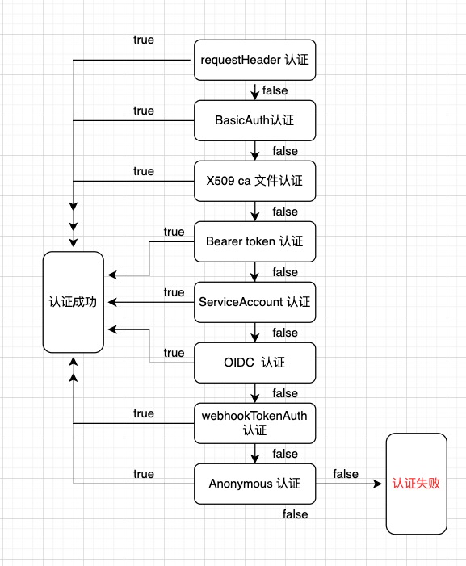

# APIServer的认证机制

## Kubernetes用户分类

所有的Kubernetes集群都有两类用户：由Kubernetes管理的**服务账号**和**普通用户**

其中服务账号（ServiceAccount）提供给集群中的程序使用，以Secret资源包存凭据，挂载到Pod中，从而允许集群内的服务调用k8s API。

而普通用户，一般由证书创建，Kubernetes使用整数中的'subject'的通用名称(Common Name)字段来确定用户名。

## 身份认证策略



> 注：认证器的执行顺序为随机的，途中流向不代表固定顺序

当客户端请求到达APIServer，请求首先进入认证环节，对应处理认证的是Authentication Handler方法，

Authentication Handler方法中，遍历每一个已启用的认证器，任一认证器返回true，则认证成功，全部失败，则认证失败。


> staging/src/k8s.io/apiserver/pkg/endpoints/filters/authentication.go：50

```go
func withAuthentication(handler http.Handler, auth authenticator.Request, failed http.Handler, apiAuds authenticator.Audiences, requestHeaderConfig *authenticatorfactory.RequestHeaderConfig, metrics authenticationRecordMetricsFunc) http.Handler {
	if auth == nil {
		klog.Warning("Authentication is disabled")
		return handler
	}
	standardRequestHeaderConfig := &authenticatorfactory.RequestHeaderConfig{
		UsernameHeaders:     headerrequest.StaticStringSlice{"X-Remote-User"},
		GroupHeaders:        headerrequest.StaticStringSlice{"X-Remote-Group"},
		ExtraHeaderPrefixes: headerrequest.StaticStringSlice{"X-Remote-Extra-"},
	}
	return http.HandlerFunc(func(w http.ResponseWriter, req *http.Request) {
		authenticationStart := time.Now()

		if len(apiAuds) > 0 {
			req = req.WithContext(authenticator.WithAudiences(req.Context(), apiAuds))
		}
		resp, ok, err := auth.AuthenticateRequest(req)
		authenticationFinish := time.Now()
		defer func() {
			metrics(req.Context(), resp, ok, err, apiAuds, authenticationStart, authenticationFinish)
		}()
		if err != nil || !ok {
			if err != nil {
				klog.ErrorS(err, "Unable to authenticate the request")
			}
			failed.ServeHTTP(w, req)
			return
		}

		if !audiencesAreAcceptable(apiAuds, resp.Audiences) {
			err = fmt.Errorf("unable to match the audience: %v , accepted: %v", resp.Audiences, apiAuds)
			klog.Error(err)
			failed.ServeHTTP(w, req)
			return
		}

		// authorization header is not required anymore in case of a successful authentication.
		req.Header.Del("Authorization")

		// delete standard front proxy headers
		headerrequest.ClearAuthenticationHeaders(
			req.Header,
			standardRequestHeaderConfig.UsernameHeaders,
			standardRequestHeaderConfig.GroupHeaders,
			standardRequestHeaderConfig.ExtraHeaderPrefixes,
		)

		// also delete any custom front proxy headers
		if requestHeaderConfig != nil {
			headerrequest.ClearAuthenticationHeaders(
				req.Header,
				requestHeaderConfig.UsernameHeaders,
				requestHeaderConfig.GroupHeaders,
				requestHeaderConfig.ExtraHeaderPrefixes,
			)
		}

		// http2 is an expensive protocol that is prone to abuse,
		// see CVE-2023-44487 and CVE-2023-39325 for an example.
		// Do not allow unauthenticated clients to keep these
		// connections open (i.e. basically degrade them to the
		// performance of http1 with keep-alive disabled).
		if utilfeature.DefaultFeatureGate.Enabled(genericfeatures.UnauthenticatedHTTP2DOSMitigation) && req.ProtoMajor == 2 && isAnonymousUser(resp.User) {
			// limit this connection to just this request,
			// and then send a GOAWAY and tear down the TCP connection
			// https://github.com/golang/net/commit/97aa3a539ec716117a9d15a4659a911f50d13c3c
			w.Header().Set("Connection", "close")
		}

		req = req.WithContext(genericapirequest.WithUser(req.Context(), resp.User))
		handler.ServeHTTP(w, req)
	})
}
```

