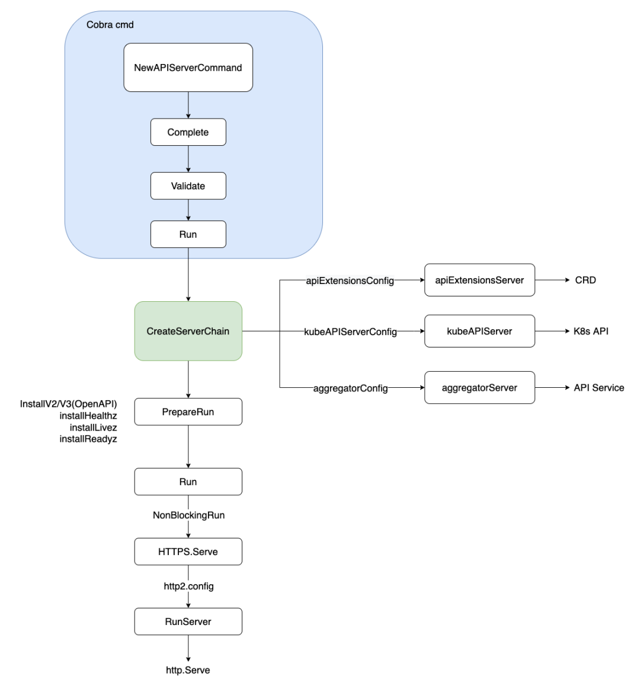

[TOC]

# Abstract

apiserver是k8s控制面的一个组件，在众多组件中唯一一个对接etcd,对外暴露http服务的形式为k8s中各种资源提供增删改查等服务。它是RESTful风格，每个资源的URI都会形如
`/apis/{apiGroup}/{version}/namsspaces/{ns-name}/{resource-kind}/{resource-name}`
或
`/apis/{apiGroup}/{version}/{resource-kind}/{resource-name}`
apiserver中包含3个server组件，apiserver依靠这3个组件来对不同类型的请求提供处理

- APIExtensionServer: 主要负责处理CustomResourceDefination（CRD）方面的请求
- KubeAPIServer: 主要负责处理k8s内置资源的请求，此外还会包括通用处理，认证、鉴权等
- AggregratorServer: 主要负责aggregrate方面的处理，它充当一个代理服务器，将请求转发到聚合进来的k8s service中。

# 启动流程



## Cobro参数解析

APIServer命令行参数解析通过`cmd/kube-apiserver/app/server.go`中`func NewAPIServerCommand()`实现，通过RunE中的return位置跳转到Run函数。

```go
RunE: func(cmd *cobra.Command, args []string) error {
			verflag.PrintAndExitIfRequested()
			fs := cmd.Flags()

			// Activate logging as soon as possible, after that
			// show flags with the final logging configuration.
			if err := logsapi.ValidateAndApply(s.Logs, utilfeature.DefaultFeatureGate); err != nil {
				return err
			}
			cliflag.PrintFlags(fs)

			// set default options
			completedOptions, err := s.Complete()
			if err != nil {
				return err
			}

			// validate options
			if errs := completedOptions.Validate(); len(errs) != 0 {
				return utilerrors.NewAggregate(errs)
			}
			// add feature enablement metrics
			utilfeature.DefaultMutableFeatureGate.AddMetrics()
			return Run(cmd.Context(), completedOptions)
		},
```

# Run函数是主函数

run函数执行3件事情：

1. 启动APIServer的3个server组件的路由
2. 注册健康检查，就绪探针，存活探针的地址
3. 启动http服务

> cmd/kube-apiserver/app/server.go：134

```go
func Run(ctx context.Context, opts options.CompletedOptions) error {
	// To help debugging, immediately log version
	klog.Infof("Version: %+v", version.Get())

	klog.InfoS("Golang settings", "GOGC", os.Getenv("GOGC"), "GOMAXPROCS", os.Getenv("GOMAXPROCS"), "GOTRACEBACK", os.Getenv("GOTRACEBACK"))
	//写配置
	config, err := NewConfig(opts)
	if err != nil {
		return err
	}
	completed, err := config.Complete()
	if err != nil {
		return err
	}
    //注册server的路由，做好配置，但是没有启动
	server, err := CreateServerChain(completed)
	if err != nil {
		return err
	}
	//注册健康检查，就绪，存活探针的地址
	prepared, err := server.PrepareRun()
	if err != nil {
		return err
	}
	//运行http server
	return prepared.Run(ctx)
}
```

> cmd/kube-apiserver/app/config.go---func NewConfig(opts options.CompletedOptions) (*Config, error)
>
> cmd/kube-apiserver/app/config.go---func (c *Config) Complete() (CompletedConfig, error)
>
> cmd/kube-apiserver/app/server.go---func CreateServerChain(config CompletedConfig) (*aggregatorapiserver.APIAggregator, error)
>
> vendor/k8s.io/kube-aggregator/pkg/apiserver/apiserver.go---func (s *APIAggregator) PrepareRun() (preparedAPIAggregator, error)
>
> vendor/k8s.io/kube-aggregator/pkg/apiserver/apiserver.go---func (s preparedAPIAggregator) Run(ctx context.Context)


## APIServer的配置参数初始化

APIServer的配置参数比较多，大致做以下分类：

- genericConfig，通用配置，三个Server都会使用
- OpenAPI配置
- Storage（ETCD）配置
- Authentication认证配置
- Authorization授权配置

### genericConfig

```go
// cmd/kube-apiserver/app/config.go:74
// NewConfig creates all the resources for running kube-apiserver, but runs none of them.
func NewConfig(opts options.CompletedOptions)(*Config, error){
    c :=&Config{
        Options: opts,
    }
    //genericConfig, versionedInformers, storageFactory在CreateKubeAPIServerConfig函数中被使用
	genericConfig, versionedInformers, storageFactory, err := controlplaneapiserver.BuildGenericConfig(
		opts.CompletedOptions,
		[]*runtime.Scheme{legacyscheme.Scheme, apiextensionsapiserver.Scheme, aggregatorscheme.Scheme},
		controlplane.DefaultAPIResourceConfigSource(),
		generatedopenapi.GetOpenAPIDefinitions,
	)
    	if err != nil {
		return nil, err
	}
	//KubeAPIs中包含apiExtensions和aggregator中需要的很多依赖
	kubeAPIs, serviceResolver, pluginInitializer, err := CreateKubeAPIServerConfig(opts, genericConfig, versionedInformers, storageFactory)
	if err != nil {
		return nil, err
	}
	c.KubeAPIs = kubeAPIs

	apiExtensions, err := controlplaneapiserver.CreateAPIExtensionsConfig(*kubeAPIs.ControlPlane.Generic, kubeAPIs.ControlPlane.VersionedInformers, pluginInitializer, opts.CompletedOptions, opts.MasterCount,
		serviceResolver, webhook.NewDefaultAuthenticationInfoResolverWrapper(kubeAPIs.ControlPlane.ProxyTransport, kubeAPIs.ControlPlane.Generic.EgressSelector, kubeAPIs.ControlPlane.Generic.LoopbackClientConfig, kubeAPIs.ControlPlane.Generic.TracerProvider))
	if err != nil {
		return nil, err
	}
	c.ApiExtensions = apiExtensions

	aggregator, err := controlplaneapiserver.CreateAggregatorConfig(*kubeAPIs.ControlPlane.Generic, opts.CompletedOptions, kubeAPIs.ControlPlane.VersionedInformers, serviceResolver, kubeAPIs.ControlPlane.ProxyTransport, kubeAPIs.ControlPlane.Extra.PeerProxy, pluginInitializer)
	if err != nil {
		return nil, err
	}
	c.Aggregator = aggregator

	return c, nil
}


```

### OpenAPI配置

Kubernetes 支持将其 API 的描述以 OpenAPI v3 形式发布。

APIServer会动态地生成OpenAPI的定义文件，描述集群中的所有API资源和操作；由OpenAPI服务器提供访问，OpenAPIServer从APIServer获取最新的OpenAPI 定义，并通过HTTP服务的方式对外提供定义文件。

当客户端需要获取 Kubernetes 集群的 OpenAPI 定义时,会向 OpenAPI 服务器发送请求。
OpenAPI 服务器收到请求后,会查找缓存或直接从 API 服务器拉取最新的 OpenAPI 定义,并返回给客户端。

OpenAPI服务器一般会同时部署v2和v3版本，v3可以提供更完整的API信息。

基本信息

```yaml
openapi: 3.0.0
info:
  title: Kubernetes API
  version: v1.23.0
```

服务器信息

```yaml
servers:
- url: https://kubernetes.default.svc
  description: The default API server
```

API路径和HTTP方法，请求参数和响应结构和内容

```yaml
paths:
  /api/v1/namespaces:
    get:
      summary: list or watch objects of kind Namespace
      parameters:
      - name: fieldSelector
        in: query
        schema:
          type: string
      responses:
        '200':
          description: OK
          content:
            application/json:
              schema:
                $ref: '#/components/schemas/V1NamespaceList'
  /api/v1/namespaces/{name}:
    get:
      summary: read the specified Namespace
      parameters:
      - name: name
        in: path
        required: true
        schema:
          type: string
      responses:
        '200':
          description: OK
          content:
            application/json:
              schema:
                $ref: '#/components/schemas/V1Namespace'
```

API的数据模型：

```yaml
components:
  schemas:
    V1Namespace:
      type: object
      properties:
        apiVersion:
          type: string
        kind:
          type: string
        metadata:
          $ref: '#/components/schemas/V1ObjectMeta'
        spec:
          $ref: '#/components/schemas/V1NamespaceSpec'
        status:
          $ref: '#/components/schemas/V1NamespaceStatus'
```


### Storage（etcd）配置

> pkg/controlplane/apiserver/config.go：187

```go
//配置	
storageFactoryConfig := kubeapiserver.NewStorageFactoryConfig()

storageFactoryConfig.APIResourceConfig = genericConfig.MergedResourceConfig
//实例化	
storageFactory, lastErr = storageFactoryConfig.Complete(s.Etcd).New()
```

定义了etcd的地址、认证、存储路径的prefix等信息后实例化了etcd storage对象。


### 认证配置

APIServer支持如下的认证策略：

- X509 Client Certs
- Static Token File
- Bootstrap Tokens
- Service Account Tokens
- OpenID Connect Tokens（OIDC）
- Webhook Token Authentication
- Authenticating Proxy

```go
//pkg/controlplane/apiserver/config.go:208	
genericConfig.Authorization.Authorizer, genericConfig.RuleResolver, enablesRBAC, err = BuildAuthorizer(
		ctx,
		s,
		genericConfig.EgressSelector,
		genericConfig.APIServerID,
		versionedInformers,
	)
```

一系列的Authenticator认证在New（）函数中实例化

> pkg/kubeapiserver/authenticator/config.go

```go
func (config Config) New(serverLifecycle context.Context) (authenticator.Request, func(context.Context, *apiserver.AuthenticationConfiguration) error, *spec.SecurityDefinitions, spec3.SecuritySchemes, error) {
	var authenticators []authenticator.Request
	var tokenAuthenticators []authenticator.Token
	securityDefinitionsV2 := spec.SecurityDefinitions{}
	securitySchemesV3 := spec3.SecuritySchemes{}

	// front-proxy, BasicAuth methods, local first, then remote
	// Add the front proxy authenticator if requested
	if config.RequestHeaderConfig != nil {
		requestHeaderAuthenticator := headerrequest.NewDynamicVerifyOptionsSecure(
			config.RequestHeaderConfig.CAContentProvider.VerifyOptions,
			config.RequestHeaderConfig.AllowedClientNames,
			config.RequestHeaderConfig.UsernameHeaders,
			config.RequestHeaderConfig.GroupHeaders,
			config.RequestHeaderConfig.ExtraHeaderPrefixes,
		)
		authenticators = append(authenticators, authenticator.WrapAudienceAgnosticRequest(config.APIAudiences, requestHeaderAuthenticator))
	}

	// X509 methods
	if config.ClientCAContentProvider != nil {
		certAuth := x509.NewDynamic(config.ClientCAContentProvider.VerifyOptions, x509.CommonNameUserConversion)
		authenticators = append(authenticators, certAuth)
	}

	// Bearer token methods, local first, then remote
	if len(config.TokenAuthFile) > 0 {
		tokenAuth, err := newAuthenticatorFromTokenFile(config.TokenAuthFile)
		if err != nil {
			return nil, nil, nil, nil, err
		}
		tokenAuthenticators = append(tokenAuthenticators, authenticator.WrapAudienceAgnosticToken(config.APIAudiences, tokenAuth))
	}
	if len(config.ServiceAccountKeyFiles) > 0 {
		serviceAccountAuth, err := newLegacyServiceAccountAuthenticator(config.ServiceAccountKeyFiles, config.ServiceAccountLookup, config.APIAudiences, config.ServiceAccountTokenGetter, config.SecretsWriter)
		if err != nil {
			return nil, nil, nil, nil, err
		}
		tokenAuthenticators = append(tokenAuthenticators, serviceAccountAuth)
	}
	if len(config.ServiceAccountIssuers) > 0 {
		serviceAccountAuth, err := newServiceAccountAuthenticator(config.ServiceAccountIssuers, config.ServiceAccountKeyFiles, config.APIAudiences, config.ServiceAccountTokenGetter)
		if err != nil {
			return nil, nil, nil, nil, err
		}
		tokenAuthenticators = append(tokenAuthenticators, serviceAccountAuth)
	}

	if config.BootstrapToken && config.BootstrapTokenAuthenticator != nil {
		tokenAuthenticators = append(tokenAuthenticators, authenticator.WrapAudienceAgnosticToken(config.APIAudiences, config.BootstrapTokenAuthenticator))
	}

	// NOTE(ericchiang): Keep the OpenID Connect after Service Accounts.
	//
	// Because both plugins verify JWTs whichever comes first in the union experiences
	// cache misses for all requests using the other. While the service account plugin
	// simply returns an error, the OpenID Connect plugin may query the provider to
	// update the keys, causing performance hits.
	var updateAuthenticationConfig func(context.Context, *apiserver.AuthenticationConfiguration) error
	if config.AuthenticationConfig != nil {
		initialJWTAuthenticator, err := newJWTAuthenticator(serverLifecycle, config.AuthenticationConfig, config.OIDCSigningAlgs, config.APIAudiences, config.ServiceAccountIssuers)
		if err != nil {
			return nil, nil, nil, nil, err
		}

		jwtAuthenticatorPtr := &atomic.Pointer[jwtAuthenticatorWithCancel]{}
		jwtAuthenticatorPtr.Store(initialJWTAuthenticator)

		updateAuthenticationConfig = (&authenticationConfigUpdater{
			serverLifecycle:     serverLifecycle,
			config:              config,
			jwtAuthenticatorPtr: jwtAuthenticatorPtr,
		}).updateAuthenticationConfig

		tokenAuthenticators = append(tokenAuthenticators,
			authenticator.TokenFunc(func(ctx context.Context, token string) (*authenticator.Response, bool, error) {
				return jwtAuthenticatorPtr.Load().jwtAuthenticator.AuthenticateToken(ctx, token)
			}),
		)
	}

	if len(config.WebhookTokenAuthnConfigFile) > 0 {
		webhookTokenAuth, err := newWebhookTokenAuthenticator(config)
		if err != nil {
			return nil, nil, nil, nil, err
		}

		tokenAuthenticators = append(tokenAuthenticators, webhookTokenAuth)
	}

	if len(tokenAuthenticators) > 0 {
		// Union the token authenticators
		tokenAuth := tokenunion.New(tokenAuthenticators...)
		// Optionally cache authentication results
		if config.TokenSuccessCacheTTL > 0 || config.TokenFailureCacheTTL > 0 {
			tokenAuth = tokencache.New(tokenAuth, true, config.TokenSuccessCacheTTL, config.TokenFailureCacheTTL)
		}
		authenticators = append(authenticators, bearertoken.New(tokenAuth), websocket.NewProtocolAuthenticator(tokenAuth))

		securityDefinitionsV2["BearerToken"] = &spec.SecurityScheme{
			SecuritySchemeProps: spec.SecuritySchemeProps{
				Type:        "apiKey",
				Name:        "authorization",
				In:          "header",
				Description: "Bearer Token authentication",
			},
		}
		securitySchemesV3["BearerToken"] = &spec3.SecurityScheme{
			SecuritySchemeProps: spec3.SecuritySchemeProps{
				Type:        "apiKey",
				Name:        "authorization",
				In:          "header",
				Description: "Bearer Token authentication",
			},
		}
	}

	if len(authenticators) == 0 {
		if config.Anonymous {
			return anonymous.NewAuthenticator(), nil, &securityDefinitionsV2, securitySchemesV3, nil
		}
		return nil, nil, &securityDefinitionsV2, securitySchemesV3, nil
	}

	authenticator := union.New(authenticators...)

	authenticator = group.NewAuthenticatedGroupAdder(authenticator)

	if config.Anonymous {
		// If the authenticator chain returns an error, return an error (don't consider a bad bearer token
		// or invalid username/password combination anonymous).
		authenticator = union.NewFailOnError(authenticator, anonymous.NewAuthenticator())
	}

	return authenticator, updateAuthenticationConfig, &securityDefinitionsV2, securitySchemesV3, nil
}
```

每一种认证协议都启动一个对应的认证器。当认证请求进来时，便利各个认证器，只要有一个认证器返回true则视为认证成功，全部为false则认证失败。

### 授权配置

授权配置的流程与认证配置基本一致：

APIServer支持如下的授权策略：

- AlwaysAllow
- AlwaysDeny
- webhook授权
- node授权
- ABAC授权
- RBAC授权


> pkg/kubeapiserver/authorizer/config.go：75

```go
func (config Config) New(ctx context.Context, serverID string) (authorizer.Authorizer, authorizer.RuleResolver, error) {
	if len(config.AuthorizationConfiguration.Authorizers) == 0 {
		return nil, nil, fmt.Errorf("at least one authorization mode must be passed")
	}

	r := &reloadableAuthorizerResolver{
		initialConfig:    config,
		apiServerID:      serverID,
		lastLoadedConfig: config.AuthorizationConfiguration,
		reloadInterval:   time.Minute,
	}

	seenTypes := sets.New[authzconfig.AuthorizerType]()

	// Build and store authorizers which will persist across reloads
	for _, configuredAuthorizer := range config.AuthorizationConfiguration.Authorizers {
		seenTypes.Insert(configuredAuthorizer.Type)

		// Keep cases in sync with constant list in k8s.io/kubernetes/pkg/kubeapiserver/authorizer/modes/modes.go.
		switch configuredAuthorizer.Type {
		case authzconfig.AuthorizerType(modes.ModeNode):
			var slices resourcev1alpha2informers.ResourceSliceInformer
			if utilfeature.DefaultFeatureGate.Enabled(features.DynamicResourceAllocation) {
				slices = config.VersionedInformerFactory.Resource().V1alpha2().ResourceSlices()
			}
			node.RegisterMetrics()
			graph := node.NewGraph()
			node.AddGraphEventHandlers(
				graph,
				config.VersionedInformerFactory.Core().V1().Nodes(),
				config.VersionedInformerFactory.Core().V1().Pods(),
				config.VersionedInformerFactory.Core().V1().PersistentVolumes(),
				config.VersionedInformerFactory.Storage().V1().VolumeAttachments(),
				slices, // Nil check in AddGraphEventHandlers can be removed when always creating this.
			)
			r.nodeAuthorizer = node.NewAuthorizer(graph, nodeidentifier.NewDefaultNodeIdentifier(), bootstrappolicy.NodeRules())

		case authzconfig.AuthorizerType(modes.ModeABAC):
			var err error
			r.abacAuthorizer, err = abac.NewFromFile(config.PolicyFile)
			if err != nil {
				return nil, nil, err
			}
		case authzconfig.AuthorizerType(modes.ModeRBAC):
			r.rbacAuthorizer = rbac.New(
				&rbac.RoleGetter{Lister: config.VersionedInformerFactory.Rbac().V1().Roles().Lister()},
				&rbac.RoleBindingLister{Lister: config.VersionedInformerFactory.Rbac().V1().RoleBindings().Lister()},
				&rbac.ClusterRoleGetter{Lister: config.VersionedInformerFactory.Rbac().V1().ClusterRoles().Lister()},
				&rbac.ClusterRoleBindingLister{Lister: config.VersionedInformerFactory.Rbac().V1().ClusterRoleBindings().Lister()},
			)
		}
	}

	// Require all non-webhook authorizer types to remain specified in the file on reload
	seenTypes.Delete(authzconfig.TypeWebhook)
	r.requireNonWebhookTypes = seenTypes

	// Construct the authorizers / ruleResolvers for the given configuration
	authorizer, ruleResolver, err := r.newForConfig(r.initialConfig.AuthorizationConfiguration)
	if err != nil {
		return nil, nil, err
	}

	r.current.Store(&authorizerResolver{
		authorizer:   authorizer,
		ruleResolver: ruleResolver,
	})

	if r.initialConfig.ReloadFile != "" {
		go r.runReload(ctx)
	}

	return r, r, nil
}
```


## 三个server的创建流程

CreateServerChain函数的调用流程如下：

> cmd/kube-apiserver/app/server.go：162

```go
func CreateServerChain(config CompletedConfig) (*aggregatorapiserver.APIAggregator, error) {
    //notFoundHandler，用于处理找不到服务器的资源的请求。
	notFoundHandler := notfoundhandler.New(config.KubeAPIs.ControlPlane.Generic.Serializer, genericapifilters.NoMuxAndDiscoveryIncompleteKey)
    //创建APIExtensionServer
	apiExtensionsServer, err := config.ApiExtensions.New(genericapiserver.NewEmptyDelegateWithCustomHandler(notFoundHandler))
	if err != nil {
		return nil, err
	}
	crdAPIEnabled := config.ApiExtensions.GenericConfig.MergedResourceConfig.ResourceEnabled(apiextensionsv1.SchemeGroupVersion.WithResource("customresourcedefinitions"))
	//创建KubeAPIServer
	kubeAPIServer, err := config.KubeAPIs.New(apiExtensionsServer.GenericAPIServer)
	if err != nil {
		return nil, err
	}

	// aggregator comes last in the chain
	aggregatorServer, err := controlplaneapiserver.CreateAggregatorServer(config.Aggregator, kubeAPIServer.ControlPlane.GenericAPIServer, apiExtensionsServer.Informers.Apiextensions().V1().CustomResourceDefinitions(), crdAPIEnabled, apiVersionPriorities)
	if err != nil {
		// we don't need special handling for innerStopCh because the aggregator server doesn't create any go routines
		return nil, err
	}

	return aggregatorServer, nil
}
```

### APIExtensionServer

主要负责处理CRD方面的请求

1. 动态注册和管理CRD
2. CRD资源的验证和转化
3. 与KubeAPIServer的集成，动态扩展CRD资源并使用K8sAPI进行操作等等（例如kubectl操作）

### KubeAPIServer

负责处理K8s内置资源的请求，还包括通用处理，认证，鉴权等

1. K8s内置资源相关的API请求唯一入口点。
2. 和etcd集群进行交互 write&read
3. 对Kubernetes API请求进行授权和认证，授权规则存储在etcd中，由集群管理员统一管理和配置
4. 资源管理和操作
5. Watch&Informer

### AggregatorServer

1. 聚合和代理来自不同APIServer的请求，为K8s提供一个统一的API入口点，而不是直接访问哥哥独立的APIServer
2. 动态的API注册和发现：动态地扩展新的API资源，无需修改客户端代码
3. API请求的访问控制，授权规则独立配置和管理，之后转发到不同的APIServer上再进行授权和认证
4. 多个APIServer的负载均衡
5. 监控和日志记录

## 
