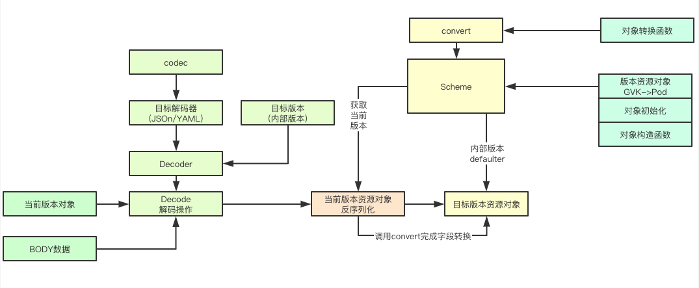

[TOC]

# Abstract

APIServer的工作主要围绕着对各种资源对象的管控，因此，阅读APIServer的源码之前，有必要概括地罗列一下他在运行中所用到的核心数据结构等基础信息。

# Group/Version/Kind/Resource

在K8s地设计中，resource是起最基础、最重要的概念，也是最小的管理单位，所有的管理对象都承载在一个个的resource实例上，为了实现这些resource地复杂管理逻辑，又进一步地将他们分组、分版本，按照逻辑层次，构造了Group、Version、Kind、、Resource等核心数据结构：

- Group：资源组，也称APIGroup，常见的有core，apps，extensions等
- Version：资源版本，即APIVersion，常见的有v1，v1beta1（不同K8s版本中，Resource的Version可能会变化）
- Kind：资源种类，描述资源的类别，例如pod、svc等
- Resource：资源实例对象，也称为APIResource
- SubResource：子资源，部分资源实例会有子资源，例如Deployment会拥有Status
- CRD：用户自定义资源类型

# 资源路径

概念层面，在K8s中，常见的资源路径锚定形式为：///，例如deployment对应的路径是：apps/v1/deployments/status

官方通常通过缩写词**GVR**(GroupVersionKind)来描述一个资源的明确锚定位置(类似于绝对路径？)，同理，**GVK**(GroupVersionKind)锚定资源的明确所属类型，在项目代码中也经常用到，例如：

> staging/src/k8s.io/apimachinery/pkg/runtime/schema/group_version.go

```go
type GroupVersionResource struct {
	Group    string
	Version  string
	Resource string
}
```

# Resource Structure

>  pkg/apis/apps/types.go：365

```go
type Deployment struct {
	metav1.TypeMeta
	// +optional
	metav1.ObjectMeta

	// Specification of the desired behavior of the Deployment.
	// +optional
	Spec DeploymentSpec

	// Most recently observed status of the Deployment.
	// +optional
	Status DeploymentStatus
}
```

> metav1.TypeMeta

```go
type TypeMeta struct {
	// Kind is a string value representing the REST resource this object represents.
	// Servers may infer this from the endpoint the client submits requests to.
	// Cannot be updated.
	// In CamelCase.
	// More info: https://git.k8s.io/community/contributors/devel/sig-architecture/api-conventions.md#types-kinds
	// +optional
	Kind string `json:"kind,omitempty" protobuf:"bytes,1,opt,name=kind"`

	// APIVersion defines the versioned schema of this representation of an object.
	// Servers should convert recognized schemas to the latest internal value, and
	// may reject unrecognized values.
	// More info: https://git.k8s.io/community/contributors/devel/sig-architecture/api-conventions.md#resources
	// +optional
	APIVersion string `json:"apiVersion,omitempty" protobuf:"bytes,2,opt,name=apiVersion"`
}
```

> metav1.ObjectMeta

```go
type ObjectMeta struct {

	Name string `json:"name,omitempty" protobuf:"bytes,1,opt,name=name"`

	GenerateName string `json:"generateName,omitempty" protobuf:"bytes,2,opt,name=generateName"`

	Namespace string `json:"namespace,omitempty" protobuf:"bytes,3,opt,name=namespace"`

	SelfLink string `json:"selfLink,omitempty" protobuf:"bytes,4,opt,name=selfLink"`

	UID types.UID `json:"uid,omitempty" protobuf:"bytes,5,opt,name=uid,casttype=k8s.io/kubernetes/pkg/types.UID"`

	ResourceVersion string `json:"resourceVersion,omitempty" protobuf:"bytes,6,opt,name=resourceVersion"`

	Generation int64 `json:"generation,omitempty" protobuf:"varint,7,opt,name=generation"`

	CreationTimestamp Time `json:"creationTimestamp,omitempty" protobuf:"bytes,8,opt,name=creationTimestamp"`

	DeletionTimestamp *Time `json:"deletionTimestamp,omitempty" protobuf:"bytes,9,opt,name=deletionTimestamp"`

	DeletionGracePeriodSeconds *int64 `json:"deletionGracePeriodSeconds,omitempty" protobuf:"varint,10,opt,name=deletionGracePeriodSeconds"`

	Labels map[string]string `json:"labels,omitempty" protobuf:"bytes,11,rep,name=labels"`

	Annotations map[string]string `json:"annotations,omitempty" protobuf:"bytes,12,rep,name=annotations"`

	OwnerReferences []OwnerReference `json:"ownerReferences,omitempty" patchStrategy:"merge" patchMergeKey:"uid" protobuf:"bytes,13,rep,name=ownerReferences"`

	Initializers *Initializers `json:"initializers,omitempty" protobuf:"bytes,16,opt,name=initializers"`

	Finalizers []string `json:"finalizers,omitempty" patchStrategy:"merge" protobuf:"bytes,14,rep,name=finalizers"`

	ClusterName string `json:"clusterName,omitempty" protobuf:"bytes,15,opt,name=clusterName"`

	ManagedFields []ManagedFieldsEntry `json:"managedFields,omitempty" protobuf:"bytes,17,rep,name=managedFields"`
}
```

# Resource操作方法

概念层面，每种resource都有对应的管理操作方法，目前支持的有：

- get
- list
- create
- update
- patch
- delete
- deletecolletction
- watch

> vendor/k8s.io/apimachinery/pkg/apis/meta/v1/types.go:1193

```go
// APIResource specifies the name of a resource and whether it is namespaced.
type APIResource struct {
  ...
	// verbs is a list of supported kube verbs (this includes get, list, watch, create,
	// update, patch, delete, deletecollection, and proxy)
	Verbs Verbs `json:"verbs" protobuf:"bytes,4,opt,name=verbs"`
  ...
}

type Verbs []string

func (vs Verbs) String() string {
	return fmt.Sprintf("%v", []string(vs))
}
```

使用[]string结构来描述所对应的操作，而[]string终归只是描述，需要与实际的存储资源CRUD操作关联，因此每种string描述的方法会map到具体的方法上，结构类似map[string]Function。

# 内部和外部Version

在k8s的设计中，Resource Version分为 external版本和internal版本，external版本（例如v1/v1beta1/v1beta2）提供给外部例如clientset使用，而对应的internal版本仅在APIServer内部使用。

区分内外版本的作用：

- 减少复杂度，方便版本维护，APIServer端处理的都是转换后的内部版本，内外版本可以独立迭代更新。
- 提供不同版本之间的转换功能，例如从v1beta1-->的过程实际上是v1beta1-->internal-->v1，转换函数会注册到scheme表中。可以转换不同外部版本资源。

内部版本和外部版本对于资源结构体定义的最显著区别是，内部资源不带json和proto标签，因为不需要序列化提供给外部。

以Deployment为例：

> 内部版本：pkg/apis/apps/types.go：355

```go
type Deployment struct {
	metav1.TypeMeta
	// +optional
	metav1.ObjectMeta

	// Specification of the desired behavior of the Deployment.
	// +optional
	Spec DeploymentSpec

	// Most recently observed status of the Deployment.
	// +optional
	Status DeploymentStatus
}
```

> 外部版本：vendor/k8s.io/api/apps/v1/types.go：359

```go
type Deployment struct {
	metav1.TypeMeta `json:",inline"`
	// Standard object's metadata.
	// More info: https://git.k8s.io/community/contributors/devel/sig-architecture/api-conventions.md#metadata
	// +optional
	metav1.ObjectMeta `json:"metadata,omitempty" protobuf:"bytes,1,opt,name=metadata"`

	// Specification of the desired behavior of the Deployment.
	// +optional
	Spec DeploymentSpec `json:"spec,omitempty" protobuf:"bytes,2,opt,name=spec"`

	// Most recently observed status of the Deployment.
	// +optional
	Status DeploymentStatus `json:"status,omitempty" protobuf:"bytes,3,opt,name=status"`
}
```

以向APIServer发起创建一个资源实例的过程为例：在解码时，APIServer首先从HTTP路径中获取对应的外部version，然后使用scheme以外部version创建一个空对象，然后将该对象转换成内部版本对应的对象结构写入etcd。

而在查询请求中，资源对象会被从内部版本转换为路径对应的外部版本，返回给请求端。

# Scheme注册表



Scheme负责各个资源版本（包括UnversionedType 和 VersionedType）的统一注册和管理，为其他组件提供根据GVK来获取对应的资源对象，也提供通过资源对象获取版本等操作，内部还持有convert对象，包装了元对象到目标对象的转换操作。

> staging/src/k8s.io/apimachinery/pkg/runtime/scheme.go：46

```go
type Scheme struct {
	// gvkToType allows one to figure out the go type of an object with
	// the given version and name.
	gvkToType map[schema.GroupVersionKind]reflect.Type

	// typeToGVK allows one to find metadata for a given go object.
	// The reflect.Type we index by should *not* be a pointer.
	typeToGVK map[reflect.Type][]schema.GroupVersionKind

	// unversionedTypes are transformed without conversion in ConvertToVersion.
	unversionedTypes map[reflect.Type]schema.GroupVersionKind

	// unversionedKinds are the names of kinds that can be created in the context of any group
	// or version
	// TODO: resolve the status of unversioned types.
	unversionedKinds map[string]reflect.Type

	// Map from version and resource to the corresponding func to convert
	// resource field labels in that version to internal version.
	fieldLabelConversionFuncs map[schema.GroupVersionKind]FieldLabelConversionFunc

	// defaulterFuncs is a map to funcs to be called with an object to provide defaulting
	// the provided object must be a pointer.
	defaulterFuncs map[reflect.Type]func(interface{})

	// converter stores all registered conversion functions. It also has
	// default converting behavior.
	converter *conversion.Converter

	// versionPriority is a map of groups to ordered lists of versions for those groups indicating the
	// default priorities of these versions as registered in the scheme
	versionPriority map[string][]string

	// observedVersions keeps track of the order we've seen versions during type registration
	observedVersions []schema.GroupVersion

	// schemeName is the name of this scheme.  If you don't specify a name, the stack of the NewScheme caller will be used.
	// This is useful for error reporting to indicate the origin of the scheme.
	schemeName string
}
```

重点的变量有：

- `gvkToType map[schema.GroupVersionKind]reflect.Type` ：用map存储从GVK到资源类型的映射关系
-  `typeToGVK map[reflect.Type][]schema.GroupVersionKind` ：从go object返回GVK，特别的是一个type会有多个对应的GVK
- `converter *conversion.Converter`：存储所有注册的转换函数

```go
type Converter struct {
    conversionFuncs           ConversionFuncs
    generatedConversionFuncs  ConversionFuncs
    ignoredUntypedConversions map[typePair]struct{}
}
```

## 注册方法

scheme表提供两个注册方法:`AddKnownType`和`AddKnownTypeWithName`，使用reflect反射的方式获取type obj的gvk然后进行注册

> staging/src/k8s.io/apimachinery/pkg/runtime/scheme.go

```go
func (s *Scheme) AddKnownTypes(gv schema.GroupVersion, types ...Object) {
	s.addObservedVersion(gv)
	for _, obj := range types {
		t := reflect.TypeOf(obj)
		if t.Kind() != reflect.Pointer {
			panic("All types must be pointers to structs.")
		}
		t = t.Elem()
		s.AddKnownTypeWithName(gv.WithKind(t.Name()), obj)
	}
}
```

> staging/src/k8s.io/apimachinery/pkg/runtime/scheme.go

```go
func (s *Scheme) AddKnownTypeWithName(gvk schema.GroupVersionKind, obj Object) {
	s.addObservedVersion(gvk.GroupVersion())
	t := reflect.TypeOf(obj)
	if len(gvk.Version) == 0 {
		panic(fmt.Sprintf("version is required on all types: %s %v", gvk, t))
	}
	if t.Kind() != reflect.Pointer {
		panic("All types must be pointers to structs.")
	}
	t = t.Elem()
	if t.Kind() != reflect.Struct {
		panic("All types must be pointers to structs.")
	}

	if oldT, found := s.gvkToType[gvk]; found && oldT != t {
		panic(fmt.Sprintf("Double registration of different types for %v: old=%v.%v, new=%v.%v in scheme %q", gvk, oldT.PkgPath(), oldT.Name(), t.PkgPath(), t.Name(), s.schemeName))
	}

	s.gvkToType[gvk] = t

	for _, existingGvk := range s.typeToGVK[t] {
		if existingGvk == gvk {
			return
		}
	}
	s.typeToGVK[t] = append(s.typeToGVK[t], gvk)

	// if the type implements DeepCopyInto(<obj>), register a self-conversion
	if m := reflect.ValueOf(obj).MethodByName("DeepCopyInto"); m.IsValid() && m.Type().NumIn() == 1 && m.Type().NumOut() == 0 && m.Type().In(0) == reflect.TypeOf(obj) {
		if err := s.AddGeneratedConversionFunc(obj, obj, func(a, b interface{}, scope conversion.Scope) error {
			// copy a to b
			reflect.ValueOf(a).MethodByName("DeepCopyInto").Call([]reflect.Value{reflect.ValueOf(b)})
			// clear TypeMeta to match legacy reflective conversion
			b.(Object).GetObjectKind().SetGroupVersionKind(schema.GroupVersionKind{})
			return nil
		}); err != nil {
			panic(err)
		}
	}
}
```

# runtime.Object

> vendor/k8s.io/apimachinery/pkg/runtime/interfaces.go

runtime.Object是k8s中所有资源类型结构的基石，作为interface被封装，所有资源对象均实现了runtime.Object。

```go
// Object interface must be supported by all API types registered with Scheme. Since objects in a scheme are
// expected to be serialized to the wire, the interface an Object must provide to the Scheme allows
// serializers to set the kind, version, and group the object is represented as. An Object may choose
// to return a no-op ObjectKindAccessor in cases where it is not expected to be serialized.
type Object interface {
	GetObjectKind() schema.ObjectKind
	DeepCopyObject() Object
}
```

> vendor/k8s.io/apimachinery/pkg/runtime/schema/interfaces.go

```go
// All objects that are serialized from a Scheme encode their type information. This interface is used
// by serialization to set type information from the Scheme onto the serialized version of an object.
// For objects that cannot be serialized or have unique requirements, this interface may be a no-op.
type ObjectKind interface {
	// SetGroupVersionKind sets or clears the intended serialized kind of an object. Passing kind nil
	// should clear the current setting.
	SetGroupVersionKind(kind GroupVersionKind)
	// GroupVersionKind returns the stored group, version, and kind of an object, or nil if the object does
	// not expose or provide these fields.
	GroupVersionKind() GroupVersionKind
}
```

- `schema.ObjectKind`提供两个方法，分别用来设置和获取gvk
- `DeepCopyObject()`用来做对象的深拷贝，这样在写操作中，可以避免直接操作对象本身。

# 序列和反序列化

使用json格式的序列化

> staging/src/k8s.io/apimachinery/pkg/runtime/serializer/json/json.go

```go
type Serializer struct {
	meta    MetaFactory
	options SerializerOptions
	creater runtime.ObjectCreater
	typer   runtime.ObjectTyper

	identifier runtime.Identifier
}
```

> staging/src/k8s.io/apimachinery/pkg/runtime/serializer/json/json.go

```go
func (s *Serializer) Encode(obj runtime.Object, w io.Writer) error {
	if co, ok := obj.(runtime.CacheableObject); ok {
		return co.CacheEncode(s.Identifier(), s.doEncode, w)
	}
	return s.doEncode(obj, w)
}

func (s *Serializer) doEncode(obj runtime.Object, w io.Writer) error {
	if s.options.Yaml {
		json, err := json.Marshal(obj)
		if err != nil {
			return err
		}
		data, err := yaml.JSONToYAML(json)
		if err != nil {
			return err
		}
		_, err = w.Write(data)
		return err
	}

	if s.options.Pretty {
		data, err := json.MarshalIndent(obj, "", "  ")
		if err != nil {
			return err
		}
		_, err = w.Write(data)
		return err
	}
	encoder := json.NewEncoder(w)
	return encoder.Encode(obj)
}
```

# go-restful

K8s选用的Restful框架是go-restful，其层级结构如下：

go-restful层级结构概念自顶向下依次有：

- Container：一个Container就是一个独立的http server，可以拥有独立的地址端口组合（类似nginx的server层级）
- WebService：大粒度的分类，某一类别的服务可归属到同一个WebService中，其下包含多个Route
- Route：meigeRoute对应具体的url路径，将该路径路由到对应的handler函数上。
