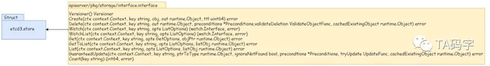
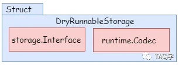
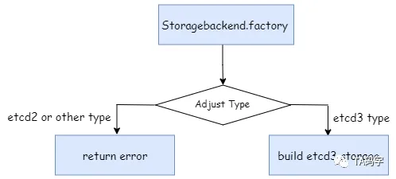
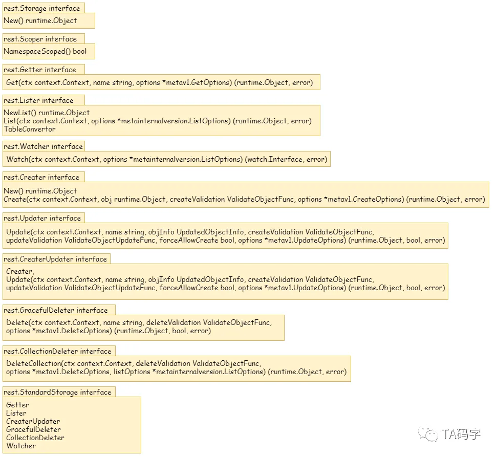
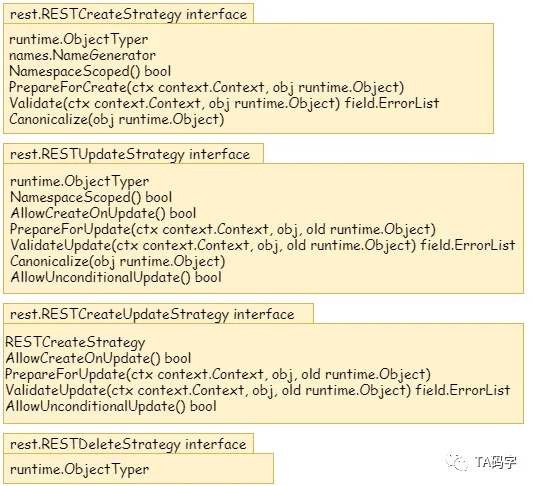

# Data Access Object


## 数据访问层

数据访问层面向etcd3集群进行操作，并向上提供支持

### 接口定义和实现



etcd3类中实现了面向etcd集群实现了 interface接口中定义的一系列功能

```go
//  k8s.io/apiserver/pkg/storage/interfaces.go
type Interface interface {
    Versioner() Versioner

    Create(ctx context.Context, key string, obj, out runtime.Object, ttl uint64) error

    Delete(ctx context.Context, key string, out runtime.Object, preconditions *Preconditions,validateDeletion ValidateObjectFunc, cachedExistingObject runtime.Object) error

    Watch(ctx context.Context, key string, opts ListOptions) (watch.Interface, error)

    WatchList(ctx context.Context, key string, opts ListOptions) (watch.Interface, error)

    Get(ctx context.Context, key string, opts GetOptions, objPtr runtime.Object) error

    GetToList(ctx context.Context, key string, opts ListOptions, listObj runtime.Object) error

    List(ctx context.Context, key string, opts ListOptions, listObj runtime.Object) error

    GuaranteedUpdate(ctx context.Context, key string, ptrToType runtime.Object, ignoreNotFound bool, precondtions *Preconditions, tryUpdate UpdateFunc, cachedExistingObject runtime.Object) error

    Count(key string) (int64, error)
}


```

```go
// k8s.io/apiserver/pkg/storage/etcd3/store.go
type store struct {
    client              *clientv3.Client
    codec               runtime.Codec
    versioner           storage.Versioner
    transformer         value.Transformer
    pathPrefix          string
    groupResource       schema.GroupResource
    groupResourceString string
    watcher             *watcher
    leaseManager        *leaseManager
}

func (s *store) Versioner() Versioner{...}
func (s *store) Create(ctx context.Context, key string, obj, out runtime.Object, ttl uint64) error{...}
func (s *store) Delete(ctx context.Context, key string, out runtime.Object, preconditions *Preconditions,validateDeletion ValidateObjectFunc, cachedExistingObject runtime.Object) error{...}
func (s *store) Watch(ctx context.Context, key string, opts ListOptions) (watch.Interface, error){...}
func (s *store) WatchList(ctx context.Context, key string, opts ListOptions) (watch.Interface, error){...}
func (s *store) Get(ctx context.Context, key string, opts GetOptions, objPtr runtime.Object) error{...}
func (s *store) GetToList(ctx context.Context, key string, opts ListOptions, listObj runtime.Object) error{...}
func (s *store) List(ctx context.Context, key string, opts ListOptions, listObj runtime.Object) error{...}
func (s *store) GuaranteedUpdate(ctx context.Context, key string, ptrToType runtime.Object, ignoreNotFound bool, precondtions *Preconditions, tryUpdate UpdateFunc, cachedExistingObject runtime.Object) error{...}
func (s *store) Count(key string) (int64, error){...}
```

- Interface 中定义了资源数据访问层的接口，包括对资源的增删改查以及watch操作
- etcd3.store结构体实现了上述定义的接口功能，在该结构体中的实现中封装了对象clientv3.Client用来完成对etcd3集群的访问和对象操作。

### Dry Run的支持

此外，为了支持k8s dry run操作，执行驱逐命令但是不对资源存储造成影响，所以在上述接口功能的定义基础上又新增了DryRunnableStorage结构体来实现此功能。其相关的示意图和源码如下：



```go
// k8s.io/apiserver/pkg/registry/generic/registry/dryrun.go

type DryRunnableStorage struct {
    Storage storage.Interface
    Codec runtime.Codec
}

func (s *DryRunnableStorage) Create(ctx context.Context, key string, obj, out runtime.Object, ttl uint64, dryRun bool) error{
    if dryRun {
		if err := s.Storage.Get(ctx, key, storage.GetOptions{}, out); err == nil {
			return storage.NewKeyExistsError(key, 0)
		}
		return s.copyInto(obj, out)
	}
	return s.Storage.Create(ctx, key, obj, out, ttl)
}

func (s *DryRunnableStorage) copyInto(in, out runtime.Object) error {
	var data []byte

	data, err := runtime.Encode(s.Codec, in)
	if err != nil {
		return err
	}
	_, _, err = s.Codec.Decode(data, nil, out)
	return err
}

...........
```

- 该结构体包含上述的数据访问接口类型的属性来完成基本数据访问操作
- 该结构体包含runtime.Codec属性来完成必要的序列化和反序列化操作
- 以创建操作的dry run 作为例子，该操作判断资源是否存在，然后内部拷贝对象返回，并不会进行实际的创建操作

### 数据访问层对象的创建

对于数据访问对象的创建过程如下：



```go
//k8s.io/apiserver/pkg/storage/storagebackend/factory/factory.go

// Create creates a storage backend based on given config.
func Create(c storagebackend.ConfigForResource, newFunc, newListFunc func() runtime.Object, resourcePrefix string) (storage.Interface, DestroyFunc, error) {
	switch c.Type {
	case storagebackend.StorageTypeETCD2:
		return nil, nil, fmt.Errorf("%s is no longer a supported storage backend", c.Type)
	case storagebackend.StorageTypeUnset, storagebackend.StorageTypeETCD3:
		return newETCD3Storage(c, newFunc, newListFunc, resourcePrefix)
	default:
		return nil, nil, fmt.Errorf("unknown storage type: %s", c.Type)
	}
}
```

- 数据访问对象的创建时集于storagebackend.Config决定的
- 对于目前的kubernetes版本来说，只支持etcd3的数据访问层
- 对于etcd2或者其它类型的数据访问层是不支持的

### 总结

以上主要介绍了数据访问层的接口以及相关得etcd3数据访问的实现，以及在访问层支持dry run的实现.服务于etcd3集群，并向之上的数据服务层提供能力支持


## 数据服务层

数据服务层使用访问层提供的能力，直接提供数据存储服务，提供对应的API

数据服务层的设计也分为接口和实现两个部分，定义接口功能，由相关得具体实现类来实现功能。K8s在服务层上定义分为两大类，一类是增删改查类接口，定义增删改查watch邓基础操作；另一类是操作的策略类型接口，用于定义资源在CRUD等基础操作中的逻辑。



```go
// staging/src/k8s.io/apiserver/pkg/registry/rest/rest.go

type Storage interface{
    //New returns an empty object that can be used with Create and Update after request data has been put into it
    //This object must be a pointer type for use with Codec.DecodeInto ([]byte, runtime.Object)
    New() runtime.Object
	
    // Destroy cleans up its resources on shutdown.
	// Destroy has to be implemented in thread-safe way and be prepared for being called more than once.    
    Destroy()
}

type Scoper interface{
    //NamespaceScoped returns true if the storage is namespaced
    NamespaceScoped() bool
}

//KindProvider用于指定其API的种类与内部存储的种类不同。对于一些没有被编译到API服务器中的外部对象，它们在内存中只能用通用对象（例如，runtime.Unknow）的形式呈现。但是进行API注册的时候，我们希望它们能表现出具体的种类，而不是通用对象
type KindProvider interface{
    Kind() string
}

// ShortNamesProvider is an interface for RESTful storage services. Delivers a list of short names for a resource. The list is used by kubectl to have short names representation of resources.
type ShortNamesProvider interface {
	ShortNames() []string
}

// CategoriesProvider 允许资源指定它所归属的资源组（类别），Categories可以被API客户端使用，以便通过一个单一的名称来引用一批资源（例如，all可以代表Pod Replication Controller Service等 ）
type CategoriesProvider interface {
	Categories() []string
}
// SingularNameProvider返回一个资源的单数名称，用于kubectl的发现功能，如果存在shortcut的重录（与CRD的shortcut冲突），应当保证singular name始终map到这个资源
type SingularNameProvider interface{
    GetSingularName() string
}

// GroupVersionKindProvider 指定某个特定的GVK可被发现，这用于多态端点，它们通常只想外部版本，例如Scale指向Scale.v1
type GroupVersionKindProvider interface {
	GroupVersionKind(containingGV schema.GroupVersion) schema.GroupVersionKind
}

//Lister对象可以根据提供的字段和标签标准 检索对应的资源
type Lister interface{
    //NewList返回一个可以调用List方法的空对象，返回的空对象必须是 一个指针，指向Codec.DecodeInto([]byte, runtime.Object) 类型 
    NewList() runtime.Object
    //List 选择在存储中匹配选择器的资源， options参数可以为空
    List(ctx context.Context, options *metainternalversion.ListOptions) (runtime.Object, error)
    //TableConvertor 确保了所有的list实现都实现了table conversion
    TableCOnvertor
}

// Getter 可以检索置定名字的的RESTful 资源
type Getter interface {
    //Get通过名字寻找资源并返回它；虽然可以返回任意错误值，但是当指定的资源未找到时，返回的错误值 err 会使 IsNotFound(err) 为真
	Get(ctx context.Context, name string, options *metav1.GetOptions) (runtime.Object, error)
}

//Creater 对象可以创建RESTful对象的实例
type Creater interface {
    //New返回一个空对象，可以在请求数据后用于Create操作，为了与Codec.DecodeInto([]byte,runtime.Object)使用，这个对象必须是指针类类型
	New() runtime.Object

	//Create方法用于创建资源的新版本
	Create(ctx context.Context, obj runtime.Object, createValidation ValidateObjectFunc, options *metav1.CreateOptions) (runtime.Object, error)
}

// Updater对象可以更新RESTful对象的实例
type Updater interface {
	// New returns an empty object that can be used with Update after request data has been put into it.
	// This object must be a pointer type for use with Codec.DecodeInto([]byte, runtime.Object)
	New() runtime.Object

	//UPdate方法在存储中查找资源并对其进行更新，一些实现可能允许更新操作创建对象，此时应该将created bool设置为true
	Update(ctx context.Context, name string, objInfo UpdatedObjectInfo, createValidation ValidateObjectFunc, updateValidation ValidateObjectUpdateFunc, forceAllowCreate bool, options *metav1.UpdateOptions) (runtime.Object, bool, error)
}


//CreaterUpdater是一个存储对象，必须同时支持创建和更新操作，Go语言不允许嵌入具有相同方法的接口
type CreaterUpdater interface {
	Creater
	Update(ctx context.Context, name string, objInfo UpdatedObjectInfo, createValidation ValidateObjectFunc, updateValidation ValidateObjectUpdateFunc, forceAllowCreate bool, options *metav1.UpdateOptions) (runtime.Object, bool, error)
}

//Watcher接口应当被所有希望提供watch api监控变化的 存储类实现
type Watcher interface {
	//options 参数中：label 用于根据标签进行选择；field 用于根据对象的字段进行选择。并非所有字段都受支持；如果 field 尝试选择不支持的字段，应该返回错误。resourceVersion 允许在特定版本上继续或开始监视。
	Watch(ctx context.Context, options *metainternalversion.ListOptions) (watch.Interface, error)
}

//StandardStorage包含了存储类的常见操作。用于测试一个资源是否满足了一般的存储方法。传递不透明的存储对象时，应当使用Storage
type StandardStorage interface {
	Getter
	Lister
	CreaterUpdater
	GracefulDeleter
	CollectionDeleter
	Watcher

	// Destroy cleans up its resources on shutdown.
	// Destroy has to be implemented in thread-safe way and be prepared
	// for being called more than once.
	Destroy()
}
```

- 对于不同的CRUD以及watch操作均有不同类型的独立接口与之对应，例如Storage，Getter，Lister，Creater，Updater等等
- 聚合类型接口StandardStorage封装了一些独立接口功能




```go
//k8s.io/apiserver/pkg/registry/rest/create.go


//
type RESTCreateStrategy interface{
    runtime.ObjectTyper
    
    names.NameGenerator
}

```


