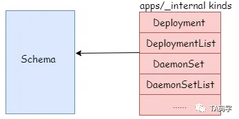
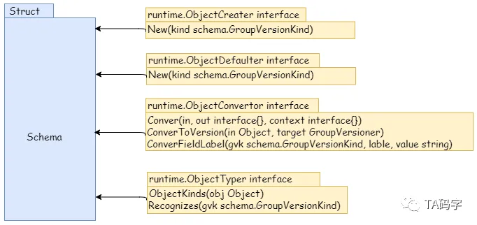
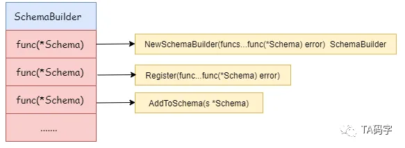
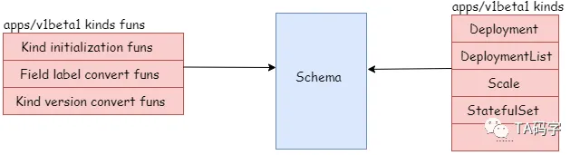

# Scheme

## Defination：Structure of Scheme

Scheme是k8s管理资源的核心数据结构，因为k8s会将其管理的资源换分为group/version/kind的概念，我们可以将资源在内部版本和其他版本中相互转化，或者可以在序列化反序列化的过程中试别资源类型，创建资源对象，设置默认值等等。这些group/version/kind和资源model的对应关系，不同版本之间的互相转换函数全部由scheme维护。



```go
type Scheme struct {
	// GVK To Type
	gvkToType map[schema.GroupVersionKind]reflect.Type

	// Type to GVK
	typeToGVK map[reflect.Type][]schema.GroupVersionKind

	// unversionedTypes are transformed without conversion in ConvertToVersion.
	unversionedTypes map[reflect.Type]schema.GroupVersionKind

	// unversionedKinds are the names of kinds that can be created in the context of any group
	// or version
	// TODO: resolve the status of unversioned types.
	unversionedKinds map[string]reflect.Type

	// Map from version and resource to the corresponding func to convert
	// resource field labels in that version to internal version.
	fieldLabelConversionFuncs map[schema.GroupVersionKind]FieldLabelConversionFunc

	// defaulterFuncs is a map to funcs to be called with an object to provide defaulting
	// the provided object must be a pointer.
	defaulterFuncs map[reflect.Type]func(interface{})

	// converter stores all registered conversion functions. It also has
	// default converting behavior.
	converter *conversion.Converter

	// versionPriority is a map of groups to ordered lists of versions for those groups indicating the
	// default priorities of these versions as registered in the scheme
	versionPriority map[string][]string

	// observedVersions keeps track of the order we've seen versions during type registration
	observedVersions []schema.GroupVersion

	// schemeName is the name of this scheme.  If you don't specify a name, the stack of the NewScheme caller will be used.
	// This is useful for error reporting to indicate the origin of the scheme.
	schemeName string
}
```

Scheme还实现了一些接口，使得scheme可以创建资源对象，给资源对象赋予默认值，识别资源对象类型，资源对象版本转换、label转换等等。



- 实现runtime.ObjectCreater接口定义的方法完成资源的创建
- 实现runtime.ObjectDefaulter接口定义的方法完成资源默认值
- 实现runtime.ObjectConvert接口定义方法完成资源不同版本之间的互相转化
- 实现runtime.ObjectTyper接口定义的方法完成资源的类型识别

## 资源对象如何在Schema中完成注册

### SchemeBuilder对象




```go
type SchemeBuilder []func(*Scheme) error

// AddToScheme applies all the stored functions to the scheme. A non-nil error
// indicates that one function failed and the attempt was abandoned.
func (sb *SchemeBuilder) AddToScheme(s *Scheme) error {
	for _, f := range *sb {
		if err := f(s); err != nil {
			return err
		}
	}
	return nil
}

// Register adds a scheme setup function to the list.
func (sb *SchemeBuilder) Register(funcs ...func(*Scheme) error) {
	for _, f := range funcs {
		*sb = append(*sb, f)
	}
}

// NewSchemeBuilder calls Register for you.
func NewSchemeBuilder(funcs ...func(*Scheme) error) SchemeBuilder {
	var sb SchemeBuilder
	sb.Register(funcs...)
	return sb
}
```

- schemebuilder对象本质上是一个函数数组集合，其中的函数入参为schema类型。
- Register函数将入参中的函数组全部添加到SchemeBuilder函数

- schemabuilder对象有AddToScheme（）这个方法，本质上将Scheme对象放到SchemeBuilder下的每个函数中跑一边，全部通过才算是成功

### 资源的外部版本注册

以apps/v1beta1为例子，介绍该组下的v1beta1的资源是如何注册到schema中的，其图解如下：



对于外部资源版本的注册包括资源model类型的注册，资源的初始化函数，资源的label转换函数，和内部版本互相转换函数的注册。

- 资源model类型的注册源码如下：

```go
//  staging/src/k8s.io/api/apps/v1beta1/register.go
const GroupName = "apps"

// SchemeGroupVersion is group version used to register these objects
var SchemeGroupVersion = schema.GroupVersion{Group: GroupName, Version: "v1beta1"}

// Resource takes an unqualified resource and returns a Group qualified GroupResource
func Resource(resource string) schema.GroupResource {
	return SchemeGroupVersion.WithResource(resource).GroupResource()
}

var (
	// TODO: move SchemeBuilder with zz_generated.deepcopy.go to k8s.io/api.
	// localSchemeBuilder and AddToScheme will stay in k8s.io/kubernetes.
	SchemeBuilder      = runtime.NewSchemeBuilder(addKnownTypes)
	localSchemeBuilder = &SchemeBuilder
	AddToScheme        = localSchemeBuilder.AddToScheme
)

// Adds the list of known types to the given scheme.
func addKnownTypes(scheme *runtime.Scheme) error {
	scheme.AddKnownTypes(SchemeGroupVersion,
		&Deployment{},
		&DeploymentList{},
		&DeploymentRollback{},
		&Scale{},
		&StatefulSet{},
		&StatefulSetList{},
		&ControllerRevision{},
		&ControllerRevisionList{},
	)
	metav1.AddToGroupVersion(scheme, SchemeGroupVersion)
	return nil
}
```

上述源代码中，