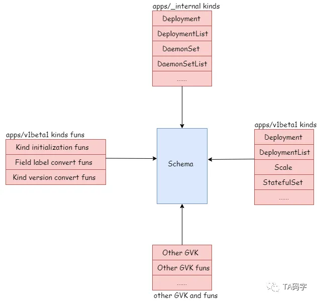

# Scheme

## Defination：Structure of Scheme

Scheme是k8s管理资源的核心数据结构，因为k8s会将其管理的资源换分为group/version/kind的概念，我们可以将资源在内部版本和其他版本中相互转化，或者可以在序列化反序列化的过程中试别资源类型，创建资源对象，设置默认值等等。这些group/version/kind和资源model的对应关系，不同版本之间的互相转换函数全部由scheme维护。


```go
type Scheme struct {
	// GVK To Type
	gvkToType map[schema.GroupVersionKind]reflect.Type

	// Type to GVK
	typeToGVK map[reflect.Type][]schema.GroupVersionKind

	// unversionedTypes are transformed without conversion in ConvertToVersion.
	unversionedTypes map[reflect.Type]schema.GroupVersionKind

	// unversionedKinds are the names of kinds that can be created in the context of any group
	// or version
	// TODO: resolve the status of unversioned types.
	unversionedKinds map[string]reflect.Type

	// Map from version and resource to the corresponding func to convert
	// resource field labels in that version to internal version.
	fieldLabelConversionFuncs map[schema.GroupVersionKind]FieldLabelConversionFunc

	// defaulterFuncs is a map to funcs to be called with an object to provide defaulting
	// the provided object must be a pointer.
	defaulterFuncs map[reflect.Type]func(interface{})

	// converter stores all registered conversion functions. It also has
	// default converting behavior.
	converter *conversion.Converter

	// versionPriority is a map of groups to ordered lists of versions for those groups indicating the
	// default priorities of these versions as registered in the scheme
	versionPriority map[string][]string

	// observedVersions keeps track of the order we've seen versions during type registration
	observedVersions []schema.GroupVersion

	// schemeName is the name of this scheme.  If you don't specify a name, the stack of the NewScheme caller will be used.
	// This is useful for error reporting to indicate the origin of the scheme.
	schemeName string
}
```

Scheme还实现了一些接口，使得scheme可以创建资源对象，给资源对象赋予默认值，识别资源对象类型，资源对象版本转换、label转换等等。


- 实现runtime.ObjectCreater接口定义的方法完成资源的创建
- 实现runtime.ObjectDefaulter接口定义的方法完成资源默认值
- 实现runtime.ObjectConvert接口定义方法完成资源不同版本之间的互相转化
- 实现runtime.ObjectTyper接口定义的方法完成资源的类型识别

## 资源对象如何在Schema中完成注册

### SchemeBuilder对象


```go
type SchemeBuilder []func(*Scheme) error

// AddToScheme applies all the stored functions to the scheme. A non-nil error
// indicates that one function failed and the attempt was abandoned.
func (sb *SchemeBuilder) AddToScheme(s *Scheme) error {
	for _, f := range *sb {
		if err := f(s); err != nil {
			return err
		}
	}
	return nil
}

// Register adds a scheme setup function to the list.
func (sb *SchemeBuilder) Register(funcs ...func(*Scheme) error) {
	for _, f := range funcs {
		*sb = append(*sb, f)
	}
}

// NewSchemeBuilder calls Register for you.
func NewSchemeBuilder(funcs ...func(*Scheme) error) SchemeBuilder {
	var sb SchemeBuilder
	sb.Register(funcs...)
	return sb
}
```

- schemebuilder对象本质上是一个函数数组集合，其中的函数入参为schema类型。
- Register函数将入参中的函数组全部添加到SchemeBuilder函数

- schemabuilder对象有AddToScheme（）这个方法，本质上将Scheme对象放到SchemeBuilder下的每个函数中跑一边，全部通过才算是成功

### 资源的外部版本注册

K8s中外部版本资源，指的是对用户和开发创建和管理K8s资源使用的，保证在不同版本的稳定性和向后兼容，同时提供了自定义资源的扩展性

以apps/v1beta1为例子，介绍该组下的v1beta1的资源是如何注册到schema中的，其图解如下：


对于外部资源版本的注册包括资源model类型的注册，资源的初始化函数，资源的label转换函数，和内部版本互相转换函数的注册。

- 资源model类型的注册源码如下：

```go
//  staging/src/k8s.io/api/apps/v1beta1/register.go
const GroupName = "apps"

// SchemeGroupVersion is group version used to register these objects
var SchemeGroupVersion = schema.GroupVersion{Group: GroupName, Version: "v1beta1"}

// Resource takes an unqualified resource and returns a Group qualified GroupResource
func Resource(resource string) schema.GroupResource {
	return SchemeGroupVersion.WithResource(resource).GroupResource()
}

var (
	// TODO: move SchemeBuilder with zz_generated.deepcopy.go to k8s.io/api.
	// localSchemeBuilder and AddToScheme will stay in k8s.io/kubernetes.
	SchemeBuilder      = runtime.NewSchemeBuilder(addKnownTypes)
	localSchemeBuilder = &SchemeBuilder
	AddToScheme        = localSchemeBuilder.AddToScheme
)

// Adds the list of known types to the given scheme.
func addKnownTypes(scheme *runtime.Scheme) error {
	scheme.AddKnownTypes(SchemeGroupVersion,
		&Deployment{},
		&DeploymentList{},
		&DeploymentRollback{},
		&Scale{},
		&StatefulSet{},
		&StatefulSetList{},
		&ControllerRevision{},
		&ControllerRevisionList{},
	)
	metav1.AddToGroupVersion(scheme, SchemeGroupVersion)
	return nil
}
```

上述源代码中，创建了schemebuilder这个对象，并且设置了组为apps，版本为v1beta1，然后把属于apps/v1beta1中的所有类型的资源model进行了注册，例如deployment，statsfulset等等资源。

- 资源默认值初始化函数和label转换函数的注册的源码如下：

```go
//pkg/apis/apps/v1beta1/register.go


// GroupName is the group name use in this package
const GroupName = "apps"

// SchemeGroupVersion is group version used to register these objects
var SchemeGroupVersion = schema.GroupVersion{Group: GroupName, Version: "v1beta1"}

// Resource takes an unqualified resource and returns a Group qualified GroupResource
func Resource(resource string) schema.GroupResource {
	return SchemeGroupVersion.WithResource(resource).GroupResource()
}

var (
	localSchemeBuilder = &appsv1beta1.SchemeBuilder
	AddToScheme        = localSchemeBuilder.AddToScheme
)

func init() {
	// We only register manually written functions here. The registration of the
	// generated functions takes place in the generated files. The separation
	// makes the code compile even when the generated files are missing.
	localSchemeBuilder.Register(addDefaultingFuncs, addConversionFuncs)
}

// pkg/apis/apps/v1beta1/defaults.go

func addDefaultingFuncs(scheme *runtime.Scheme) error {
  return RegisterDefaults(scheme)
}


// pkg/apis/apps/v1beta1/conversion.go

func addConversionFuncs(scheme *runtime.Scheme) error {
  // Add field label conversions for kinds having selectable nothing but ObjectMeta fields.
  if err := scheme.AddFieldLabelConversionFunc(SchemeGroupVersion.WithKind("StatefulSet"),
    func(label, value string) (string, string, error) {
      switch label {
      case "metadata.name", "metadata.namespace", "status.successful":
        return label, value, nil
      default:
        return "", "", fmt.Errorf("field label not supported for appsv1beta1.StatefulSet: %s", label)
      }
    }); err != nil {
    return err
  }

  return nil
}
```

在上述源代码中，源文件pkg/apis/apps/v1beta1/register.go中引用了上面介绍的schemabuilder对象，然后在这个对象中添加了addDefaultingFuncs函数作为资源的初始换函数，addConversionFuncs作为资源的label转换函数。

- 资源外部版本和内部版本互相转换函数

```go
//pkg/apis/apps/v1beta1/zz_generated.conversion.go

func init() {
	localSchemeBuilder.Register(RegisterConversions)
}

//RegisterConversions adds conversion functions to the given scheme
//Publis to allow building arbitrary schemes
func RegisterConversions(s *runtime.Scheme) error{
    .........
    if err := s.AddGeneratedConversionFunc((*v1beta1.ControllerRevision)(nil), (*apps.ControllerRevision)(nil), func(a, b interface{}, scope conversion.Scope) error {
		return Convert_v1beta1_ControllerRevision_To_apps_ControllerRevision(a.(*v1beta1.ControllerRevision), b.(*apps.ControllerRevision), scope)
	}); err != nil {
		return err
	}
	........
    
}
```

pkg/apis/apps/v1beta1/zz_generated.conversion.go中localSchemeBuilder即引用了上面介绍的schemabuilder对象，然后再对象中添加了RegisterConversions函数作为内外部版本转换函数，在该函数中定义了各个资源在当前版本和内部版本如何转换。

### 资源的内部版本注册

K8s内部版本是服务于内部自身集群管理和操作的，这些资源版本仅用于K8s核心组件之间，并不向用户暴露，并且在不同版本中的改变不做保证，一般用于K8s控制平面的高效交互中。


内部资源的注册在构造SchemeBuilder的时候就已经完成。

```go
// pkg/apis/apps/register.go

const GroupName = "apps"

var SchemeGroupVersion = schema.GroupVersion{Group: GroupName, Version: runtime.APIVersionInternal}

var (
  SchemeBuilder = runtime.NewSchemeBuilder(addKnownTypes).
  AddToScheme = SchemeBuilder.AddToScheme
)

func addKnownTypes(scheme *runtime.Scheme) error {
  scheme.AddKnownTypes(SchemeGroupVersion,
    &DaemonSet{},
    &DaemonSetList{},
    &Deployment{},
    &DeploymentList{},
    &DeploymentRollback{},
    &autoscaling.Scale{},
    &StatefulSet{},
    &StatefulSetList{},
    &ControllerRevision{},
    &ControllerRevisionList{},
    &ReplicaSet{},
    &ReplicaSetList{},
  )
  return nil
}

// k8s.io/apimachinery/pkg/runtime/interfaces.go

const (
  APIVersionInternal = "__internal"
)
```

此处将内部版本进行注册。


## 资源内外部版本注册的驱动

apps组作为例子，驱动整个内部版本资源和外部版本资源的注册如下：

```go

// pkg/apis/apps/install/install.go

func init() {
  Install(legacyscheme.Scheme)
}

func Install(scheme *runtime.Scheme) {
  //内部版本注册，对应在// pkg/apis/apps/register.go
  	utilruntime.Must(apps.AddToScheme(scheme))
  /*外部版本的注册，包括model和内外部版本转换函数，对应在
    //pkg/apis/apps/v1beta1/register.go
    //pkg/apis/apps/v1beta1/zz_generated.conversion.go
    // pkg/apis/apps/v1beta1/conversion.go
   */
  	utilruntime.Must(v1beta1.AddToScheme(scheme))
  	utilruntime.Must(v1beta2.AddToScheme(scheme))
  	utilruntime.Must(v1.AddToScheme(scheme))
  	utilruntime.Must(scheme.SetVersionPriority(v1.SchemeGroupVersion, 		v1beta2.SchemeGroupVersion, v1beta1.SchemeGroupVersion))
}
```

legacyscheme包中操作得到一个Schema对象，然后把app租下的所有版本资源都进行注册，包括内部版本，以及v1/v1beta1/vabeta2等所有外部版本，如下图展示了各组不同版本资源到schema的注册。


